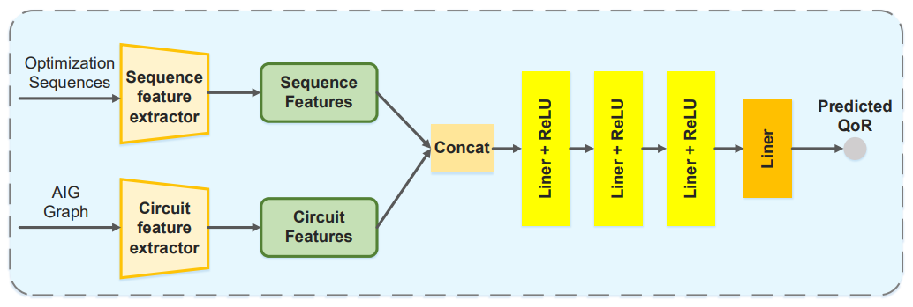

# QoR Prediction Framework

## Overview

This repository contains a comprehensive framework for predicting Quality of Results (QoR) metrics in logic synthesis using various neural network architectures. The framework includes both traditional approaches (GNN, Transformer, LSTM, CNN) and our novel LSOformer architecture.

## Repository Structure

qor_prediction_framework/
├── traditional_models/ # GNN, Transformer, LSTM, CNN implementations
│ ├── README.md
│ ├── data/
│ ├── models/
│ ├── utils/
│ ├── train.py
│ └── inference.py
├── lsoformer/ # Novel LSOformer architecture
│ ├── README.md
│ ├── data/
│ ├── models/
│ ├── utils/
│ ├── train.py
│ └── inference.py
├── scripts/ # Utility scripts
│ ├── generate_graphs.py
│ ├── generate_tables.py
│ └── train_all_models.sh
├── data/ # Shared datasets
│ ├── bench_files/
│ ├── graphs/
│ ├── results.csv
│ └── test_results.csv
├── requirements.txt
└── README.md

text

## Overview of Approaches

### Traditional Models

The traditional models directory contains implementations of:

- **Graph Neural Networks (GNN)**: GCN, GAT, and GraphSAGE for circuit graph processing
- **Sequence Models**: Transformer, LSTM, and CNN for optimization recipe processing
- **Combined Models**: Integration of graph and sequence features for QoR prediction

These models follow a two-stage approach:
1. Extract features from circuit graphs and optimization sequences separately
2. Combine these features to predict QoR metrics

### LSOformer

LSOformer is our novel architecture that:

- Processes AIG graphs with level-aware encoding
- Uses a masked transformer decoder to model sequential dependencies
- Incorporates technology mapping information
- Provides step-by-step QoR predictions

This architecture is specifically designed for the logic synthesis domain and outperforms traditional approaches.

## Key Features

1. **Comprehensive Framework**: Implements multiple model architectures for comparison
2. **Domain-Specific Design**: Tailored for logic synthesis optimization
3. **Flexible Targets**: Supports prediction of different QoR metrics (nodes, levels, iterations)
4. **Reproducible Results**: Includes scripts for generating graphs and evaluation tables

## Getting Started

### Installation

git clone https://github.com/username/qor_prediction_framework.git
cd qor_prediction_framework
pip install -r requirements.txt

text

### Data Preparation

Generate graph representations from .bench files
python scripts/generate_graphs.py --bench_dir data/bench_files --output_dir data/graphs

text

### Training Models

Train a specific model
python traditional_models/train.py --csv_file data/results.csv --graph_dir data/graphs --output_dir output --gnn_type graphsage --recipe_type transformer --target nodes

Train LSOformer
python lsoformer/train.py --csv_file data/results.csv --graph_dir data/graphs --output_dir output/lsoformer --target nodes

Train all models
bash scripts/train_all_models.sh

text

### Evaluation

Generate comparison tables
python scripts/generate_tables.py --results_dir output --output_file output/comparison_tables.md

text

## Results

Our experiments show that:

1. The LSOformer architecture outperforms traditional models on all QoR metrics
2. Among traditional models, the combination of GraphSAGE and Transformer achieves the best results
3. Level-aware processing significantly improves prediction accuracy
# GraphMT
