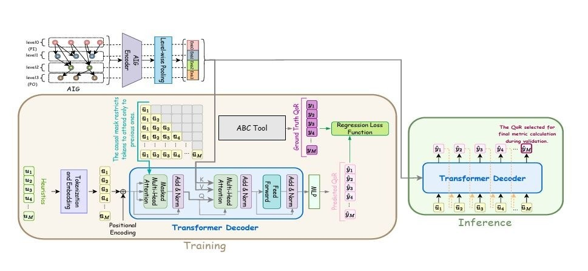

# LSOformer: Logic Synthesis Optimization Transformer

## Overview

This repository contains the implementation of LSOformer (Logic Synthesis Optimization Transformer), a novel transformer-based architecture for predicting Quality of Results (QoR) in logic synthesis. LSOformer combines AIG (And-Inverter Graph) processing with a transformer decoder to predict the impact of synthesis optimization sequences.

## Repository Structure

lsoformer/
├── data/
│ ├── init.py
│ ├── dataset.py # Dataset with level information
│ └── graph_generator.py # AIG graph generation utilities
├── models/
│ ├── init.py
│ ├── aig_embedder.py # AIG encoder with levelwise pooling
│ └── transformer_decoder_masked.py # Masked transformer decoder
├── utils/
│ ├── init.py
│ ├── config.py # Configuration parameters
│ └── metrics.py # Evaluation metrics
├── train.py # Training script
└── inference.py # Inference script

text

## Model Architecture

LSOformer consists of two main components:

### AIG Encoder with Levelwise Pooling

- Processes the AIG (And-Inverter Graph) representation of circuits
- Organizes nodes by levels (level0, level1, level2, level3)
- Applies levelwise pooling to capture the hierarchical structure
- Produces a structured representation of the circuit

### Masked Transformer Decoder

- Takes synthesis recipe tokens as input
- Applies positional encoding
- Uses masked multi-head attention to prevent looking ahead
- Processes the sequence through multiple transformer decoder layers
- Integrates technology mapping information
- Predicts QoR metrics for each step in the sequence

## Key Features

1. **Levelwise Processing**: Captures the hierarchical nature of circuit designs by processing nodes at different levels separately.

2. **Causal Masking**: Uses causal masking in the transformer decoder to ensure predictions are based only on previous optimization steps.

3. **Technology Mapping Integration**: Incorporates technology mapping information to improve prediction accuracy.

4. **Multi-step Prediction**: Predicts QoR metrics for each step in the optimization sequence, allowing for better understanding of the optimization process.

## Training Pipeline

The training pipeline consists of:

1. **AIG Processing**: Circuit graphs are processed through the AIG encoder and levelwise pooling.

2. **Recipe Embedding**: Optimization commands are embedded and positionally encoded.

3. **Transformer Decoding**: The transformer decoder processes the recipe embeddings with attention to the AIG representation.

4. **Technology Mapping**: A specialized module incorporates technology mapping information.

5. **QoR Prediction**: The model predicts QoR metrics for each step in the sequence.

6. **Loss Calculation**: Regression loss is calculated between predicted and ground truth QoR values.

## Inference

During inference:
- The trained transformer decoder processes new synthesis recipes
- The model selects the final QoR metric for calculation based on validation performance
- Step-by-step QoR predictions can be analyzed to understand the optimization process

## Usage

### Training

python train.py --csv_file data/results.csv --graph_dir data/graphs --output_dir output/lsoformer --target nodes

text

### Inference

python inference.py --csv_file data/test_results.csv --graph_dir data/graphs --output_dir output/evaluation --model_path output/lsoformer/best_model.pt

text

## Requirements

- Python 3.8+
- PyTorch 1.10+
- PyTorch Geometric 2.0+
- pandas
- numpy
- matplotlib
- scikit-learn
- tqdm

